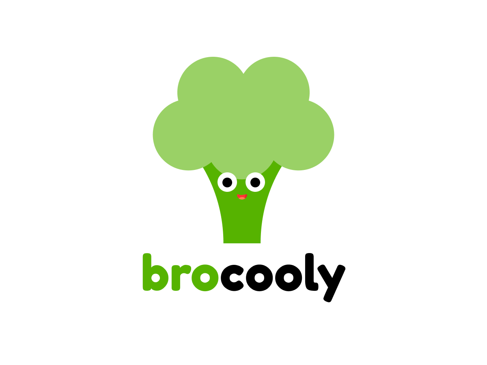

# О фреймворке :id=about

[](https://github.com/czernika/brocket/blob/master/LICENSE) [](https://gitHub.com/czernika/brocket/releases/) 

Brocket - фреймворк для разработчиков сайтов на WordPress со структурой [Bedrock](https://roots.io/bedrock/), вдохновленный синтаксисом [Laravel](https://laravel.com/), и основанный на решениях [Timber](https://timber.github.io/docs/guides/wp-integration/) и [Wpemerge](https://wpemerge.com/) для разработки произвольных тем

## Почему Brocket? :id=why-brocket

Несмотря на полноту библиотеки для различных ситуаций, WordPress по-прежнему не предоставляет единого синтаксиса для решений задач. Являясь все же CMS, а не фреймворком, он ориентирован в первую очередь на юзабилити пользователя, а не разработчика. Таким образом порой банальные задачи превращаются в массивное нагромождение строк кода, хотя и задача уже давно известна. Чего стоит только один цикл с его `have_posts()`... Отсутствие структуры, различный синтаксис даже своих же функций (например, `get_search_form()` ВЫВОДИТ, а не получает HTML формы), разные команды разработчиков с разными целями и инструментами вносит свой хаос в разработку.

Вдохновленный Laravel, Brocket Framework был создан, чтобы привнести элегантность и простоту Laravel в темы WordPress, что позволяет создавать сайты и приложения со структурой MVC, объектно-ориентированном подходом и удобным шаблонизатором twig в качестве файлов представлений. Фреймворк не ставит в основе своей цели переписать WordPress, а лишь дополнить его и улучшить работу с ним для разработчиков. Ничего более

### ООП и MVC :id=oop

Посмотрите сами - скажем, что нам нужно получить все посты из базы данных. Как мы жто сделаем? Достаточно просто

```php
// WordPress
$args = [
    'post_type'      => 'post',
    'posts_per_page' => -1,
];

$posts = new WP_Query( $args );
```

Неплохо. Но как аналогичный запрос выглядит у Brocket?

```php
// Brocket
$posts = Post::all();
```

Ларавельно!

Brocket предоставляет множество вспомогательных методов для запросов (не только `all()`) и для **ЛЮБОЙ** модели пост тайпа и таксономии. Он основан на фасадах - идея опять же взята у Laravel, удобной маршрутизации вместо иерархии шаблонов и обработке запросов внутри контроллеров 

### Представления и сборка проекта :id=views

В основе представлений лежит шаблонизатор twig, входящий вместе с пакетом Timber. Простой синтаксис избегает использования знаменитого цикла WordPress и заменить его на человекопонятное `for post in posts`. При этом использование нативных php шаблонов не возброняется

!> **В теории**, Вы даже можете подключить шаблонизатор blade, так как WPEmerge предоставляет и такую возможность при помощи [WPEmerge blade](https://github.com/htmlburger/wpemerge-blade). Однако использование шаблонизатора blade не было протестировано от слова "совсем". Во-первых, ядро фреймворка все равно будет тянуть twig, как зависимость Timber - к чему тогда эти колеса? Во-вторых, я подозреваю несовместимость версий PHP

Brocket обрабатывает маршрутизацию и рендеринг представлений при помощи WPEmerge - Вы можете ознакомиться с [документацией](https://docs.wpemerge.com/#/framework/routing/request-lifecycle) для понимания того, как именно это происходит

Локальный и глобальный контекст Brocket позволяет легко управлять динамическим контентом Ваших представлений. Любая функция или фильтр шаблонизатора twig будут работать внутри шаблонов, а если Вам нужно больше - Timber предоставляет возможность для расширения Ваших возможностей

В дополнение, Brocket поставляет готовый к работе файл `webpack.mix.js` с настроенной сборкой стилей с использованием синтаксиса SASS, скриптов, файлов изображений, шрифтов и другими возможностями. За основу взяты [AlpineJS](https://alpinejs.dev/) и [TailwindCSS](https://tailwindcss.com/) - простые, но мощные решения для работы с фронтом сайта

### Структура Bedrock :id=bedrock

Структура Bedrock повышает безопасность Вашего сайта и удобную файловую структуру для разработки. Такая файловая структура позволяет обойти взлом темы изнутри админки - злоумышленники могут лишь сменить ядро WordPress, которое просто заменить. Структура Bedrock скрывает файл `wp-config.php` и делает его практически нередактируемым - переменные, определенные внутри него, будут выбрасывать ошибку, а не исполняться и ломать сайт. Вы можете узнать более об [организации структуры от Bedrock](https://roots.io/bedrock/) и понять, почему Вы должны использовать ее

!> Так как Bedrock имеет иную структуру папок и произвольное расположение контента, могут возникать конфликты с некоторыми плагинами - особенно с теми, которые имеют тенденцию менять содержимое файла `wp-config.php`. Вы можете переписать их содержимое в файл конфигурации окружения и все должно быть в порядке. Но все же, даже с крупными "продуманными" плагинами могут возникать те или иные проблемы

Ко всему вышесказанному можно отметить, что наиболее "взламываеми" файлами внутри темы остаются `header.php` и `index.php`, которые попросту не используется внутри Brocket. Файл`functions.php` содержит в себе только подключение файла `bootstrap/app.php` и также легко восстанавливается

### Расширенные возможности при создании пост тайпов и таксономий :id=ecpt

Brocket использует пакет [extended post types](https://github.com/johnbillion/extended-cpts), который значительно улучшает юзабилити администратора при работе с пост тайпами и таксономиями - он позволяет довольно просто создавать фильтры, колонки в таблицах и иные простые, но полезные опции

### Простое создание метабоксов и опций темы :id=metaboxes-and-theme-mods

Создание метабоксов и настроек темы никогда не было столь простым вместе с [CarbonFields](https://carbonfields.net/) и [Kirki Framework](https://kirki.org/). Brocket использует оба пакета в основе и еще больше упрощает работу с ними!

## Благодарность :id=thanks

Brocket Framework своим существованием обязан следующим авторам и их пакетам:

- [WPEmerge](https://wpemerge.com/) - основа фреймворка. У WPEmerge отличная система маршрутизации и посредников, а также инициализации проекта. К тому же, при создании и регистрации метабоксов Brocket использует библиотеку [CarbonFields](https://carbonfields.net/);
- [Timber](https://timber.github.io/docs/guides/wp-integration/) - пакет Composer, который поменял мое отношение к WordPress. Вносит шаблонизатор [twig](https://twig.symfony.com/) в тему, а также упрощенные модели и обработчики запросов;
- [Bedrock](https://roots.io/bedrock/) - структура ядра и папок фреймворка. Улучшает безопасность сайта за счет иного шифрования паролей, иной структуры папок и "скрытого" нередактируемого файла `wp-config.php`;
- [Kirki Framework](https://kirki.org/) - простое и удобное создание многообразных опций темы, включая крайне полезный `repeater`;
- [Extended Post Types](https://github.com/johnbillion/extended-cpts) - улучшенное создание пост тайпов и таксономий. Отдельное спасибо за плагин [Query Monitor](https://querymonitor.com/)
- [Laravel](https://laravel.com/) - идейный вдохновитель и поставщик пакетов `illuminate` для фреймворка. Тейлор, ты гений!;
- [WordPress](https://wordpress.org/) - ядро, без которого фреймворка и не существовало бы;
- [Symfony](https://symfony.com/) - PHP компоненты, которые делают сложные вещи простыми:
- [TailwindCSS](https://tailwindcss.com/) - самый лучший CSS фреймворк:
- [AlpineJS](https://tailwindcss.com/) - простой и мощный фрейиворк для работы со скриптом.

И остальным авторам пакетов, зависимостей и плагинов, которые используется в основе фреймворка

## Лицензия :id=license

Brocket Framework использует открытую MIT [лицензию](https://github.com/czernika/brocket/blob/master/LICENSE.md)

